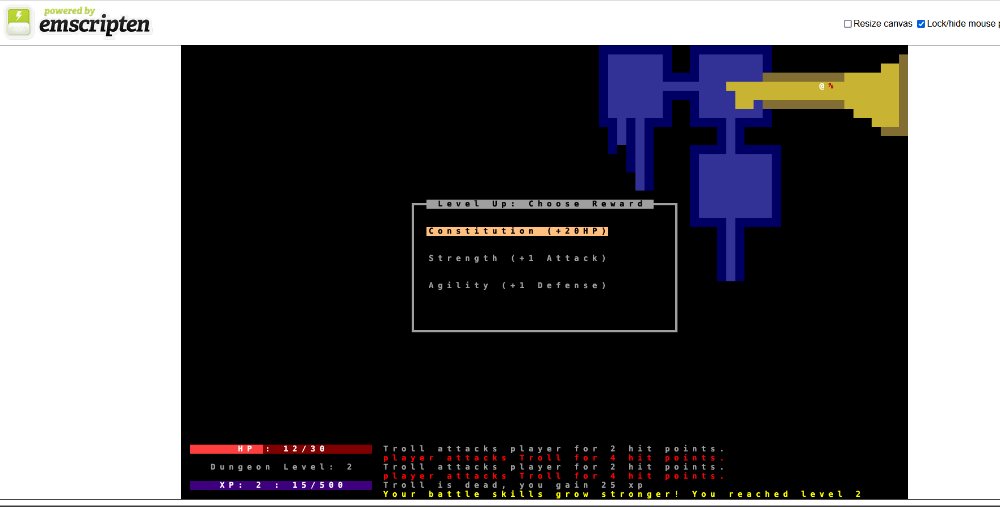

## libTCOD tutorial in C++
The [7 Day Roguelike Challenge](https://7drl.com/) for 2024 is coming up. It is being hosted on [itch.io](https://itch.io/jam/7drl-challenge-2024).

I have never made a roguelike before. So I want some code to start with for the jam and some general familiarity. So I thought I would follow the C++ tutorial for the jam. I could use Python but I wanted C++ so I can use [emscripten](https://emscripten.org/) to make a web version. That way if I actually finish something, people might actually try it out.

Unfortunately, the [tutorial](https://www.roguebasin.com/index.php/Complete_roguelike_tutorial_using_C%2B%2B_and_libtcod_-_part_1:_setting_up) is pretty old. It isn't just old style C++ which I wouldn't care much about, it has a lot of deprecated and broken parts that just don't work in the current version of libTCOD. So the point of this repository is to follow along fixing things best I can as I go along. Hopefully the code might be helpful to others if anyone wants to rewrite the tutorial at some point.

I am a vcpkg and CMake novice so I found a nice template at [https://github.com/HexDecimal/libtcod-vcpkg-template](https://github.com/HexDecimal/libtcod-vcpkg-template) and forked the code from there. That saved a ton of time and frustration, thanks! I will let you get proper instructions from the template site.

I added a notes log to document frustrations/changes along the way. I also added a Screenshots folder so you can see how it looks as I go through the tutorial. The current version looks like this:

## Dependencies
* [libTCOD](https://github.com/libtcod/libtcod): Roguelike Programming Library
* [SDL2](https://www.libsdl.org/): Window, Graphics, Sound, Input library
* [vcpkg](https://vcpkg.io/): Dependency manager
* [CMake](https://cmake.org/): Build script/project generator